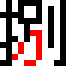
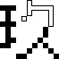

# Chinese Character Watchface (中文數字錶盤)

[Pebble App Store](https://apps.repebble.com/en_US/application/68ee48a13e917c00090b923c)

**English** | [繁體中文](#繁體中文)

---

## English

### Introduction
This is a watch face for Pebble smartwatches that displays the time and date using traditional Chinese characters. It offers a unique and elegant way to read the time, blending traditional aesthetics with modern technology.

Its code is mostly written by Google Gemini (including this README file!), but the logical part is done by a human (me).

### Features
*   **Time Display:** Traditional Chinese characters in a 2x2 grid.
*   **Date Display:** Traditional Chinese characters in a single row.
*   **Bitmap Rendering:** Does not use system fonts; characters are dynamically assembled from pre-rendered bitmap images for a stylized look.
*   **Configurable:** customizable colors and animation settings via the Clay configuration page.

### Supported Platforms
*   **Aplite** (Pebble 2 SE, Pebble Classic - BW)
*   **Basalt** (Pebble Time, Pebble Time Steel - Color)
*   **Diorite** (Pebble 2 HR - BW)
*   **Emery** (Pebble Time 2 - Color, High Res)

### Configuration
You can configure the watch face settings through the Pebble app:
*   **Colors:**
    *   **Background Color:** Customize the background color (Color platforms only).
    *   **Text Color:** Customize the main text color (Color platforms only).
    *   **Accent Color:** Highlight specific elements (default is Chrome Yellow).
    *   **Disable Accent on B&W:** Option to disable the accent color on black-and-white devices for better contrast.
*   **Animations:**
    *   **Enable Animations:** Toggle the fade/slide animations on or off.

### Display Logic

#### Time
The time is displayed in a 2x2 grid on the top portion of the screen.
*   **Hours:** The top two cells show the hour using uppercase financial-style Chinese numerals (e.g., 壹, 貳, 參).
    *   Values > 10 use "拾" (ten) or the digit (e.g., 貳 for 20) in the first cell.
    *   Midnight (0:00) is displayed as "零".
*   **Minutes:** The bottom two cells show the minutes using lowercase Chinese numerals.
    *   `00` is displayed as "點整" (o'clock).
    *   `30` is displayed as "點半" (half past).
    *   Multiples of 10 (10, 20, etc.) use "十", "廿", "卅".

#### Date
The date is displayed in a single row at the bottom of the screen.
*   **Month:** Uppercase Chinese numerals.
*   **Day:** Lowercase Chinese numerals.
*   **Day of Week:** "日" for Sunday, and numerals (一 to 六) for Monday through Saturday.

### Technical Implementation
This watch face is written in C using the Pebble SDK. The display avoids standard font rendering limitations by using pre-rendered bitmap images for each Chinese character. The C code calculates which images to display based on the current time and date.

### Acknowledgements
*   [Ark Pixel Font (方舟像素字體)](https://github.com/TakWolf/ark-pixel-font) - Font: SIL Open Font License 1.1, Build Tools: MIT License.
*   [Cubic-11 (俐方體11號)](https://github.com/ACh-K/Cubic-11) - SIL Open Font License 1.1.
*   [Clay](https://github.com/pebble/clay) - MIT License.

### License
This project is licensed under the [MIT License](LICENSE).

---

## 繁體中文

### 簡介
這是一款適用於 Pebble 智慧手錶的錶盤，使用傳統繁體中文字符顯示時間和日期。它將傳統美學與現代科技結合，提供獨特且優雅的時間閱讀體驗。

本專案的程式碼主要由 Google Gemini 撰寫（包含這份 README！），但核心邏輯由人類（我）完成。

### 特色
*   **時間顯示：** 使用 2x2 網格顯示繁體中文時間。
*   **日期顯示：** 單行顯示繁體中文日期。
*   **點陣圖渲染：** 不使用系統字體，而是透過動態組合預先渲染的點陣圖圖像，呈現獨特的字體風格。
*   **可設定性：** 透過 Clay 設定頁面自訂顏色與動畫開關。

### 支援平台
*   **Aplite** (Pebble 2 SE, Pebble Classic - 黑白)
*   **Basalt** (Pebble Time, Pebble Time Steel - 彩色)
*   **Diorite** (Pebble 2 HR - 黑白)
*   **Emery** (Pebble Time 2 - 彩色，高解析度)

### 設定
您可以透過 Pebble App 調整錶盤設定：
*   **顏色設定：**
    *   **背景顏色：** 自訂背景顏色（僅限彩色機種）。
    *   **文字顏色：** 自訂主要文字顏色（僅限彩色機種）。
    *   **強調色 (Accent Color)：** 用於強調特定元素的顏色（預設為鉻黃色）。
    *   **黑白機種停用強調色：** 在黑白裝置上可選擇關閉強調色以獲得最佳對比。
*   **動畫設定：**
    *   **啟用動畫：** 開啟或關閉淡入/淡出動畫效果。

### 顯示邏輯

#### 時間 (Time)
時間顯示於螢幕上方的 2x2 網格中。
*   **小時：** 上方兩格使用中文大寫數字（如：壹、貳、參）顯示小時。
    *   大於 10 的數值（如 11, 12, 20-23），第一格會顯示「拾」或對應數字（如 20 為 貳）。
    *   午夜 (0:00) 顯示為「零」。
*   **分鐘：** 下方兩格使用中文小寫數字顯示分鐘。
    *   `00` 分顯示為「點整」。
    *   `30` 分顯示為「點半」。
    *   整十位數（10, 20, 30...）使用「十」、「廿」、「卅」。

#### 日期 (Date)
日期顯示於螢幕底部的單行區域。
*   **月份：** 使用中文大寫數字。
*   **日期：** 使用中文小寫數字。
*   **星期：** 星期日顯示為「日」，週一至週六顯示對應數字（一 至 六）。

### 技術實現
本錶盤使用 Pebble SDK 以 C 語言編寫。為了突破字體渲染的限制並確保風格統一，顯示系統不使用字體檔，而是根據當前時間動態計算並組合預先繪製的點陣圖圖像。

### 鳴謝
*   [方舟像素字體 (Ark Pixel Font)](https://github.com/TakWolf/ark-pixel-font) - 字體：SIL Open Font License 1.1，建置工具：MIT License。
*   [俐方體11號 (Cubic-11)](https://github.com/ACh-K/Cubic-11) - SIL Open Font License 1.1。
*   [Clay](https://github.com/pebble/clay) - MIT License。

### 授權
本專案採用 [MIT License](LICENSE) 授權。

---

## Asset Showcase (素材展示)

| Color devices (`*C.png`) | B&W devices (`*D.png`) | Special Characters |
| :---: | :---: | :---: |
| **Uppercase** | **Uppercase** | `dian.png` |
|  |  |  |
|  |  | |
|  |  | `zheng.png` |
|  |  |  |
|  |  | |
|  |  | `ban.png` |
|  |  |  |
|  |  | |
|  |  | |
|  |  | |
|  |  | |
| *(No `l*C.png` files)* | **Lowercase** | |
| |  | |
| |  | |
| |  | |
| |  | |
| |  | |
| |  | |
| |  | |
| |  | |
| |  | |
| |  | |
| |  | |
| |  | |
| |  | |
