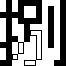

# Chinese Character Watchface (中文數字錶盤)

[Pebble App Store](https://apps.repebble.com/en_US/application/68ee48a13e917c00090b923c)

This is a watch face for Pebble smartwatches that displays the time and date using traditional Chinese characters. It offers a unique and elegant way to read the time, blending traditional aesthetics with modern technology.

Its code is mostly written by Google Gemini (incliuding this README file!), but the logical part is done by human (me).

## Display Logic (顯示邏輯)

The watch face is designed to be both beautiful and easy to read once you understand the system.

### Time (時間)

The time is displayed in a 2x2 grid on the top portion of the screen.

-   **Hours (小時):** The top two cells show the hour using uppercase financial-style Chinese numerals (e.g., 壹, 貳, 參).
    -   For hours greater than 10 (e.g., 11, 12, 20-23), the character "拾" (ten) or the corresponding digit (貳 for 20) is displayed in the first cell.
    -   Midnight (0:00) is displayed as "零".

-   **Minutes (分鐘):** The bottom two cells show the minutes using lowercase Chinese numerals (e.g., 一, 二, 三).
    -   When the minute is `00`, the characters "點整" (o'clock) are displayed.
    -   For minutes like 10, 20, 30, it uses the characters "十", "廿", "卅".
    -   For numbers like 21, it would be "廿一".

### Date (日期)

The date is displayed in a single row at the bottom of the screen.

-   **Month (月份):** Displayed first, using uppercase Chinese numerals (e.g., 壹, 貳... 拾, 拾壹, 拾貳).
-   **Day (日期):** Displayed after the month, using lowercase Chinese numerals (e.g., 一, 二... 十, 廿, 卅).
-   **Day of the Week (星期):** Displayed at the end of the line. It shows "日" for Sunday and the corresponding lowercase numeral (一, 二, 三, 四, 五, 六) for Monday through Saturday.

## Technical Implementation (技術實現)

This watch face is written in C using the Pebble SDK. The display is not rendered using fonts. Instead, it dynamically assembles pre-rendered bitmap images for each Chinese character. Each digit or character you see on the screen is a separate image, and the C code calculates which images to display in which position based on the current time and date. This method ensures high-quality, stylized character rendering that is not dependent on system fonts.

The reason why font import is not used is based on the font rendering size limitations of the Pebble SDK.

## Acknowledgements (鳴謝)

- [方舟像素字體 (ark-pixel-font)](https://github.com/TakWolf/ark-pixel-font) - The font is licensed under the SIL Open Font License 1.1, and the build program is licensed under the MIT License.
- [俐方體11號 (Cubic-11)](https://github.com/ACh-K/Cubic-11) - Licensed under the SIL Open Font License 1.1.
- [Clay](https://github.com/pebble/clay) - Licensed under the MIT License.

## Asset Showcase (素材展示)

| Color devices (`*C.png`) | B&W devices (`*D.png`) | Special Characters |
| :---: | :---: | :---: |
| **Uppercase** | **Uppercase** | `dian.png` |
|  |  |  |
|  |  | |
|  |  | `zheng.png` |
|  |  |  |
|  |  | |
|  |  | `ban.png` |
|  |  |  |
|  |  | |
|  |  | |
|  |  | |
|  |  | |
| *(No `l*C.png` files)* | **Lowercase** | |
| |  | |
| |  | |
| |  | |
| |  | |
| |  | |
| |  | |
| |  | |
| |  | |
| |  | |
| |  | |
| |  | |
| |  | |
| |  | |
